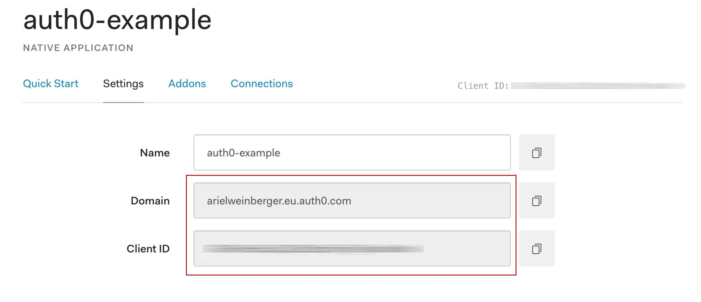

# auth0-example
Credits to https://github.com/expo/auth0-example for creating the original repo two years ago. It is currently not maintained and cannot be upgraded to new Expo versions.

## Setup
* Create your own application client on [Auth0](https://auth0.com).
* In the application settings, you must add the **redirect URL** for your Expo application that is coming from the `AuthSession` module (built-in in Expo).

  The structure of the URL is:
  `https://auth.expo.io/@your-username/your-expo-app-slug`

  Your Expo app slug can be found in the [app.json](app.json) file.

  You can get the full redirect URL by simply logging `AuthSession.getRedirectUrl()` in your own codebase.

## Managing Secrets Expo Auth0
Create a env.js file on the ./config directory, with `auth0ClientId` and `auth0Domain` values from your Auth0 application. 

(env.js is already on the .gitignore file)



#./config/env.js 
```
const ENV = {
  dev: {
    apiUrl: localhost,
    auth0ClientId: '*****',
    auth0Domain: '*****',
  },
  staging: {
    apiUrl: "[your.staging.api.here]",
  },
  prod: {
    apiUrl: "[your.production.api.here]",
  }
};

export default ENV;
```

________________________

# Install & Run
If you are using NPM:
```
npm install
npm start
```

If you are using yarn:
```
yarn install
yarn start
```


# Expo
expo build:ios --release-channel staging
expo build:android --release-channel staging
expo publish --release-channel staging

